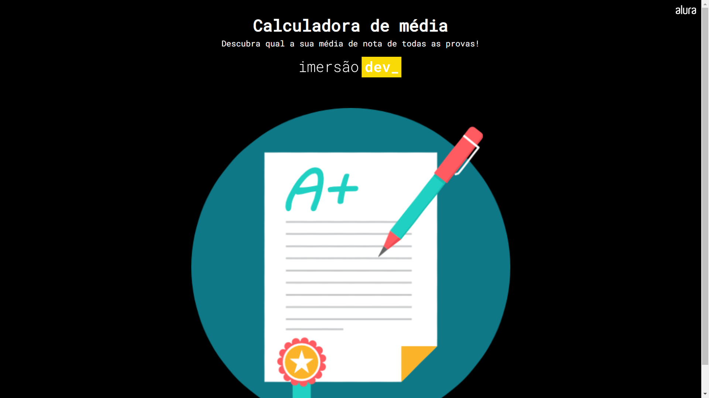

   

## 💻 Projeto 
Neste projeto criamos uma calculadora para descobrir a média das notas.

## 🚀 Tecnologias
Este projeto foi desenvolvido durante a Imersão Dev da Alura com as siguientes tecnologias:

- HTML
- CSS 
- JavaScript